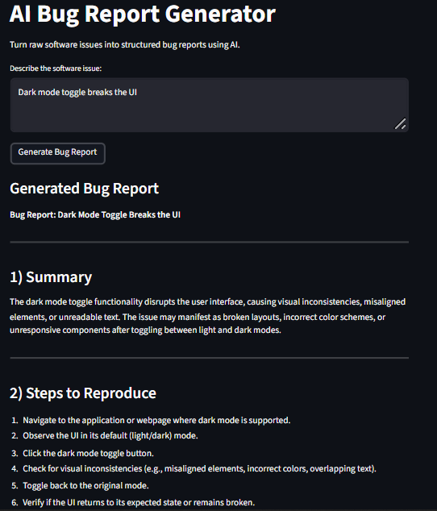
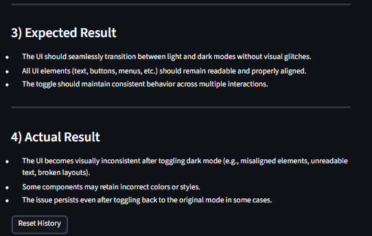

# AI Bug Report Generator

A Streamlit-based AI tool that converts software issue descriptions into structured bug reports using Mistral AI via LangChain.

---

## Features

- Converts raw issue text into professional bug reports
- Includes:
  - Summary
  - Steps to Reproduce
  - Expected Result
  - Actual Result
- Maintains conversation history
- Simple Streamlit UI



---

## Installation

```bash
git clone https://github.com/your-username/bug-report-generator.git
cd bug-report-generator
pip install -r requirements.txt